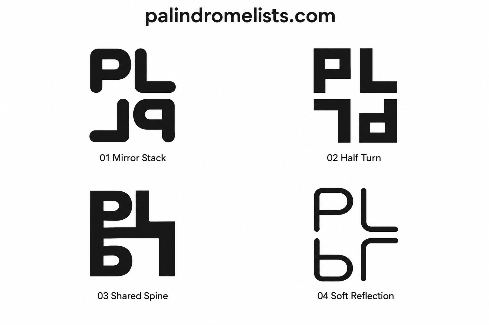

# palindromelists.com — Logo Concepts v1

First design round for a minimal website listing palindrome words and phrases. The starting idea is a readable uppercase **PL** above a reversed copy. This round explores different meanings of reversal without adding decorative symbols.

| File | Idea | Likely Use |
| --- | --- | --- |
| [01-mirror-stack.svg](01-mirror-stack.svg) | Rounded, solid PL above a horizontally mirrored pair; both the glyphs and their order reverse. | Site identity, header, avatar |
| [02-half-turn.svg](02-half-turn.svg) | Squared geometric PL above the same pair rotated 180 degrees; the full mark has rotational symmetry. | Favicon, app icon, header |
| [03-shared-spine.svg](03-shared-spine.svg) | Bold PL and its vertical reflection connect at a shared central horizontal stroke, creating one compact silhouette. | Small icon, avatar, standalone mark |
| [04-soft-reflection.svg](04-soft-reflection.svg) | Rounded monoline PL reflects across a horizontal axis with a clear gap between the rows. | Quiet header identity, larger displays |

All four editable SVGs use **#171717** ink with transparent surrounding canvases, handmade letter paths, accessible titles and descriptions, and no font dependencies. White **#FFFFFF** is the presentation background in the concept sheet. The monochrome palette keeps attention on the letterforms and symmetry.

The [concept sheet](05-concept-sheet.png) was generated with the built-in image generation tool. The SVGs are independently drawn, mathematically transformed vector interpretations of the same four directions; they are editable sources rather than automatic traces of the generated pixels. The third generated direction interpreted reversal as a vertical reflection, and its SVG follows that interpretation. The exact generation prompt is saved in [06-generation-prompt.txt](06-generation-prompt.txt).

**Suggested starting point:** 02 Half Turn. Its rotational symmetry directly suggests a palindrome, and its squared letterforms give it a clear, compact silhouette. 01 Mirror Stack is a softer alternative.

Created folder: `assets/concepts/logos/v1/`. There were no previous rounds to continue. These are concepts for review; no application code or implementation assets were changed. No tests, builds, UI checks, or adoption were performed.
