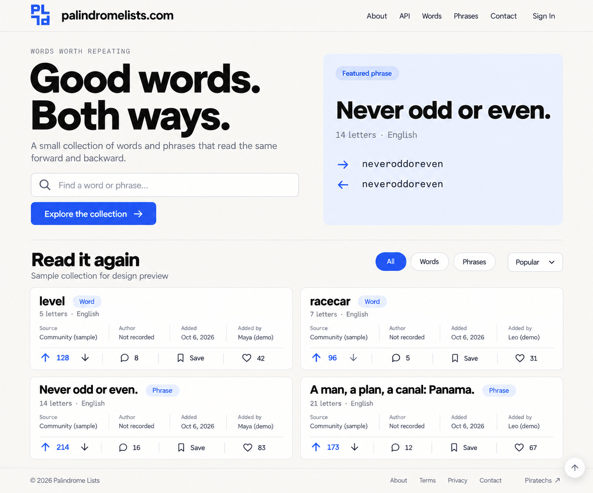
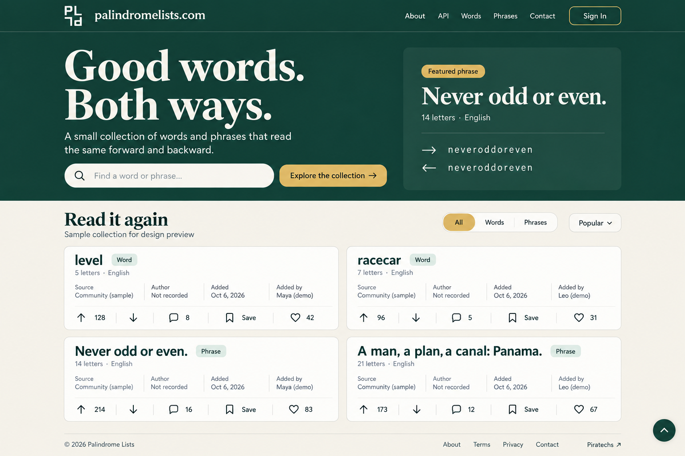

# palindromelists.com — Landing Page Mockups v1

First landing-page design round, continuing the user's approved **02 Half Turn** logo exactly. Its [original editable source](../../logos/v1/02-half-turn.svg) remains unchanged. The mockups explore colors and page typography, not new logo designs.

## Designs

| File | Direction | Palette |
| --- | --- | --- |
| [01-paper-and-cobalt.png](01-paper-and-cobalt.png) | Airy, minimal editorial page with a geometric sans-serif hero, a pale-blue featured phrase panel, and warm white cards. | Paper `#F8F7F3`, Ink `#171717`, Cobalt `#2857E8`, Pale Blue `#EDF1FF` |
| [02-forest-and-cream.png](02-forest-and-cream.png) | Dark green header and hero with a restrained serif headline; the collection rests on warm cream. White Half Turn logo and gold accents. | Forest `#143C35`, Cream `#F5F2E9`, Gold `#DCB968` |
| [03-editable-landing-design.html](03-editable-landing-design.html) | Editable, responsive design preview with both theme choices and the approved original SVG geometry. Open in a browser to view or edit the source to refine the layout. | Paper & Cobalt / Forest & Cream |
| [04-generation-prompts.txt](04-generation-prompts.txt) | Exact prompt set used with the built-in image generation tool for the two PNG mockups. | Both directions |

## Content and Layout

- Compact header: approved Half Turn logo, `palindromelists.com`, and **About, API, Words, Phrases, Contact, Sign In** links.
- Above-the-fold hero: **Good words. Both ways.**, a short description, search, and **Never odd or even.** as a featured phrase. The collection begins within the first screen on desktop.
- Collection: **All / Words / Phrases** filters, sorting, and cards for **level**, **racecar**, **Never odd or even.**, and **A man, a plan, a canal: Panama.**
- Each card: the palindrome, type, language, letter count, source, original author, entry date, contributor, vote score, comment count, save control, and heart count.
- Footer: copyright for 2026, internal About/Terms/Privacy/Contact links, and Piratechs at the right. The editable preview includes a sticky header, scroll-to-top control, and reduced-motion support.

## Data and Interaction Decisions

**Dates:** Use **Added** for the date a record enters the collection. Use **First recorded** or **Discovered** only when there is evidence about the phrase's history; an unsupported historical date should stay **Unknown**. A palindrome has no useful business-style founded date.

**Attribution:** Keep **Author** distinct from **Added by**. These examples use **Not recorded** for historical authorship and explicitly sample community sources/contributors. Profile names, engagement counts, source records, and entry dates are demonstration data, not verified historical claims.

**Letter counts:** Count letters after ignoring case, whitespace, and punctuation: `level` = 5, `racecar` = 7, `neveroddoreven` = 14, and `amanaplanacanalpanama` = 21. The hero shows that reading the normalized phrase backward produces the same text.

**Votes:** Upvote and downvote share one net score; a user may choose one vote at a time. **Comments** open discussion. **Save** bookmarks an item privately; **Heart** expresses appreciation. Public visitors can browse, search, filter, and read. Writing a vote/comment/save/heart would prompt sign-in in the eventual application.

## Scope

Created folder: `assets/concepts/mockups/v1/`. This is a separate version series from the logo concepts. The PNGs are generated design artwork and the HTML is editable mockup source; they are not a deployed app. The HTML's navigation uses the proposed internal routes and the collection actions are visual controls. No production assets, application code, previous logo artwork, or existing rounds were replaced. No tests, builds, UI checks, or publishing were run.
