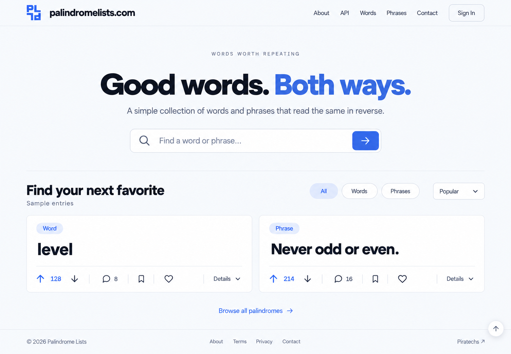
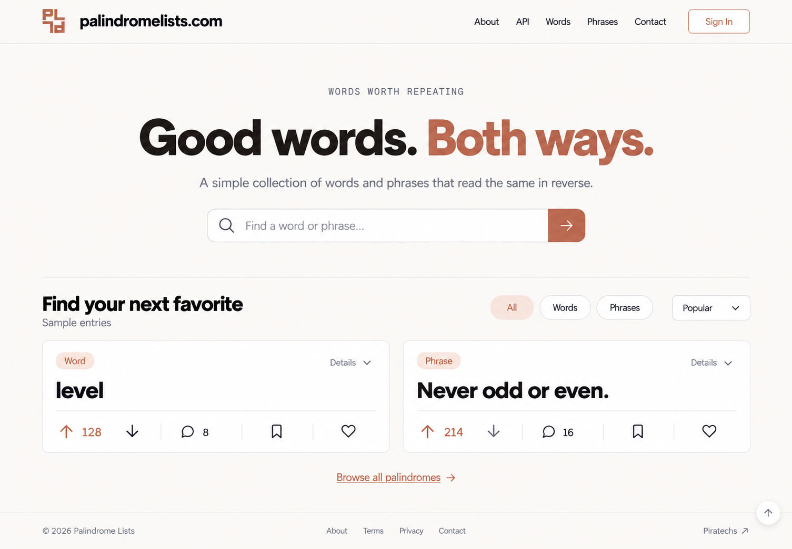
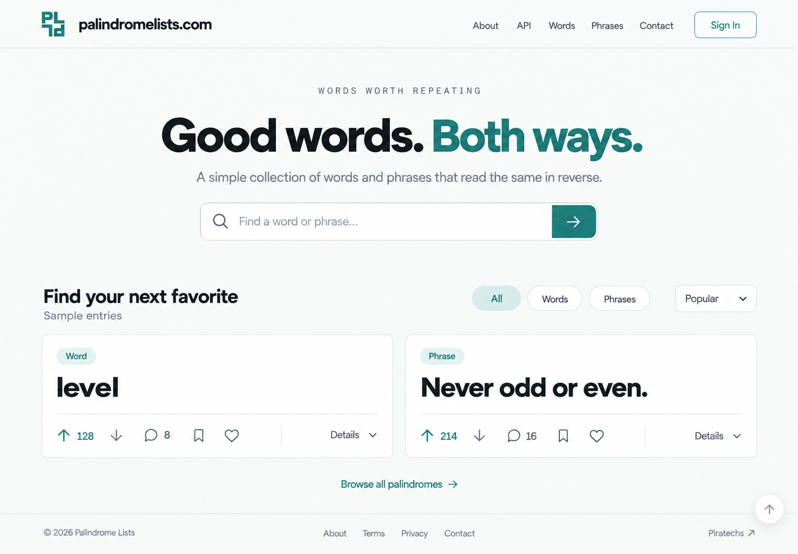

# palindromelists.com — Landing Page Mockups v2

A simpler continuation of the preferred white-and-blue design, with a new centered hero and three light accent palettes. The approved [02 Half Turn logo](../../logos/v1/02-half-turn.svg) and all v1 artwork remain unchanged.

| File | Direction | Palette |
| --- | --- | --- |
| [01-soft-blue.png](01-soft-blue.png) | Light blue with a centered hero and quiet white cards. | Accent `#4776DB`, Page `#F8FAFD`, Soft `#EBF1FC` |
| [02-clay.png](02-clay.png) | Warm white with restrained terracotta accents. | Accent `#C46952`, Page `#FCFAF7`, Soft `#F7E9E1` |
| [03-lagoon.png](03-lagoon.png) | Cool white with teal accents. | Accent `#218078`, Page `#F7FAF8`, Soft `#E6F2ED` |
| [04-editable-landing-design.html](04-editable-landing-design.html) | Responsive editable mockup with all three palette choices and expandable card details. | All three palettes |
| [05-generation-prompts.txt](05-generation-prompts.txt) | Exact prompt set used with the built-in image generation tool. | All three directions |

The hero has one centered headline, one short sentence, and one search field. The collection initially presents two entries: **level** and **Never odd or even.** Each card shows its type, palindrome, and a compact row for upvote, downvote, comments, save, and heart. Only vote and comment counts appear initially.

Source, original author, Added date, contributor, historical discovery, language, and letter count live under a closed **Details** disclosure. The HTML uses native expandable details, preserving the richer data while keeping the initial view quiet. Names, dates, sources, and engagement counts remain sample data.

The header retains About, API, Words, Phrases, Contact, and Sign In. The editable source references the approved SVG directly and changes only its displayed color. It also includes a sticky header with scroll blur, reduced-motion support, a scroll-to-top control, and a copyright/Piratechs footer.

Created folder: `assets/concepts/mockups/v2/`. This is reviewable design artwork and editable mockup source. Prior rounds and application code remain unchanged; no tests, builds, UI checks, or publishing were run.
