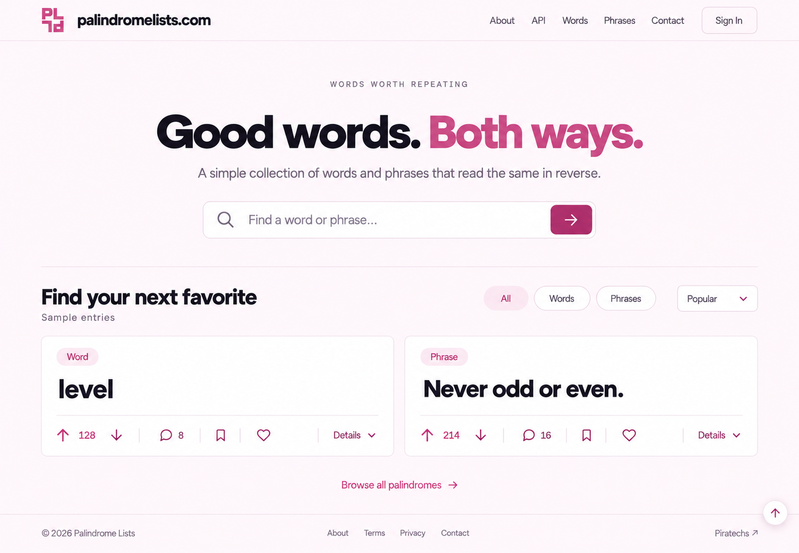
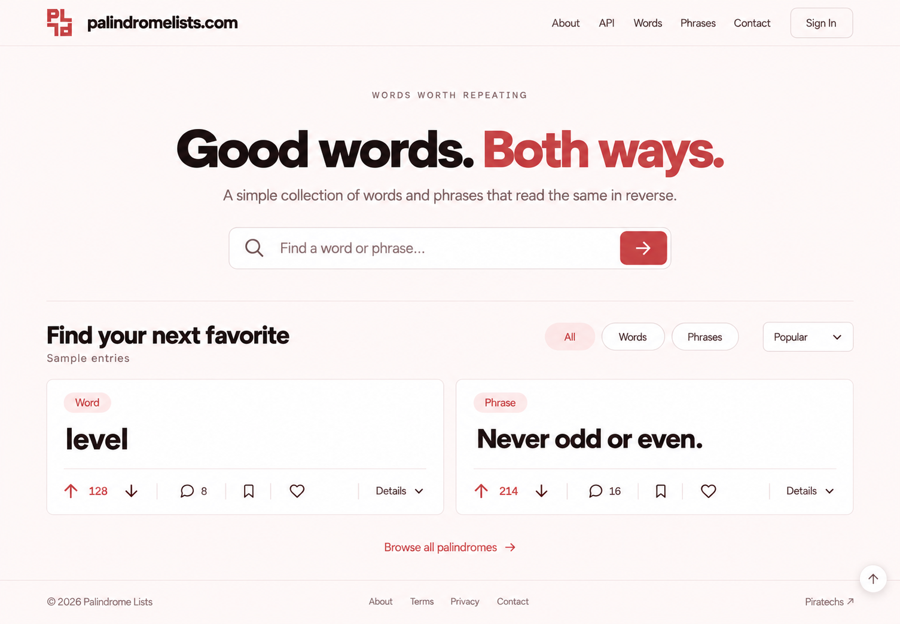
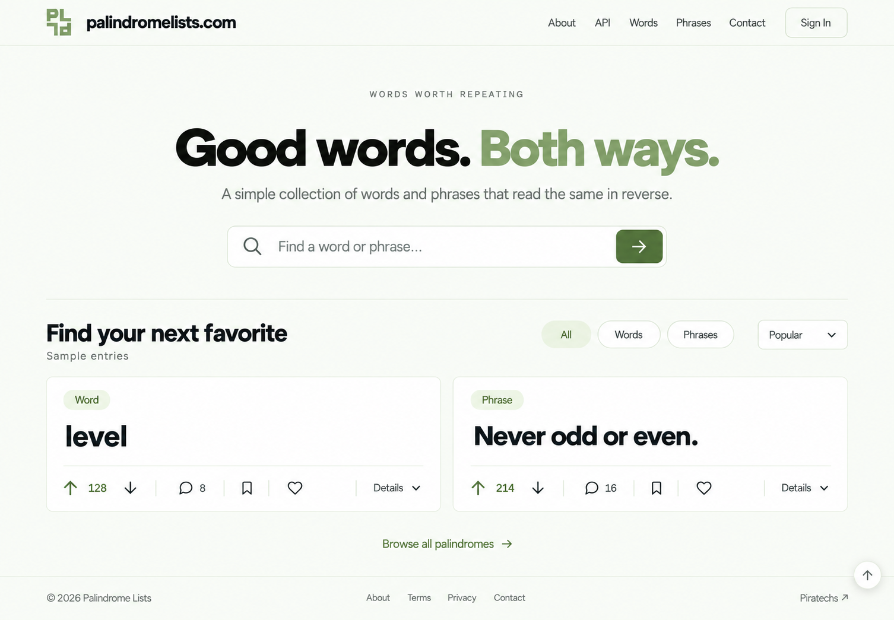
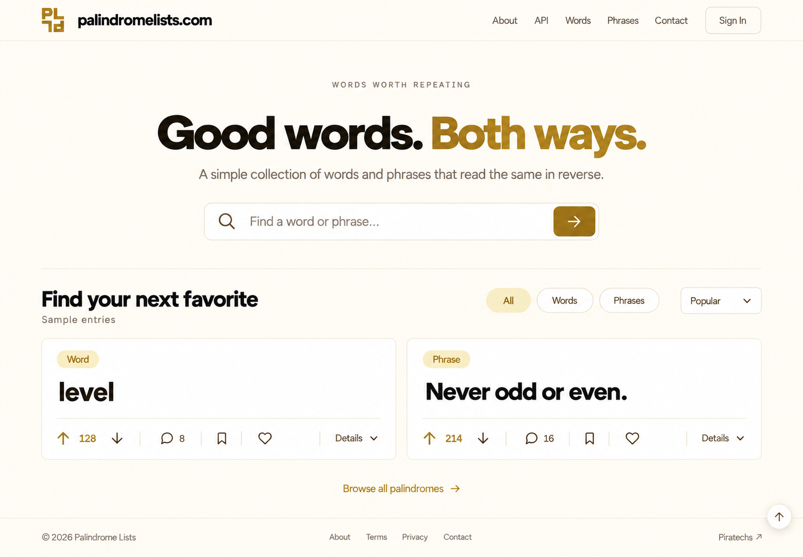

# palindromelists.com — Color Round v3

Four color explorations of the approved simplified v2 landing-page layout. The centered hero, two cards, collapsed Details, navigation, and original [Half Turn logo source](../../logos/v1/02-half-turn.svg) are retained. Earlier rounds remain intact.

| File | Palette | Accent | Small Controls | Page / Soft Tint |
| --- | --- | --- | --- | --- |
| [01-rose-pink.png](01-rose-pink.png) | Rose Pink | `#CD4F85` | `#A62F63` | `#FFF9FC` / `#FBE7F0` |
| [02-poppy-red.png](02-poppy-red.png) | Poppy Red | `#CE4A4A` | `#B93636` | `#FFF9F8` / `#FCE7E4` |
| [03-light-sage.png](03-light-sage.png) | Light Sage | `#8DAC78` | `#496E38` | `#FAFCF7` / `#EEF5E6` |
| [04-mustard-yellow.png](04-mustard-yellow.png) | Mustard Yellow | `#B38922` | `#88620B` | `#FFFCF4` / `#F6EDCE` |

White cards and dark primary text carry through all four palettes. Light sage and mustard use deeper shades for small control text and button fills.

[05-editable-landing-design.html](05-editable-landing-design.html) is an editable, responsive copy of v2 with four switchable palettes. Rose opens by default. Only theme variables, swatches, palette choices, and preview version labels changed; the layout and SVG references are preserved.

The four PNGs were produced with the built-in image generation tool as color edits of [v2 Soft Blue](../v2/01-soft-blue.png). The exact prompt set is in [06-generation-prompts.txt](06-generation-prompts.txt).

Created folder: `assets/concepts/mockups/v3/`. No application code, prior rounds, or original logo assets changed. No tests, builds, UI checks, or publishing were run.
