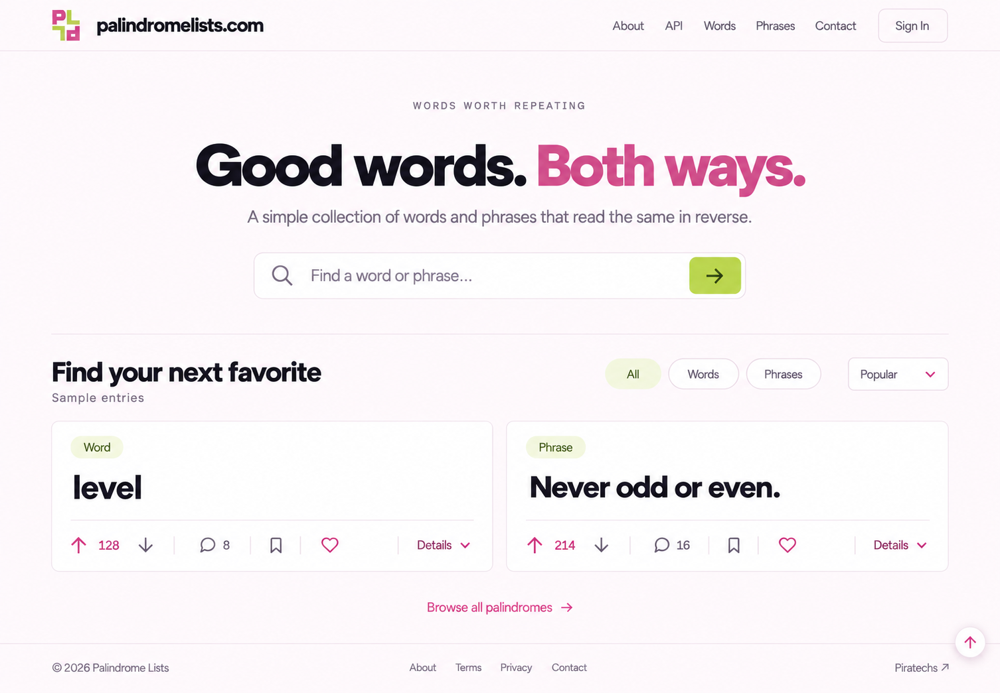

# palindromelists.com — Pink & Lime v4

Pink and lime applied to the approved simple landing-page layout. Both **P** letterforms in the Half Turn monogram are pink; both **L** letterforms are lime, including the lower rotated pair.

| File | Purpose |
| --- | --- |
| [01-half-turn-pink-lime.svg](01-half-turn-pink-lime.svg) | Editable, transparent two-color logo using the exact approved P/L paths, spacing, viewBox, and 180-degree transform. |
| [02-pink-lime-landing.png](02-pink-lime-landing.png) | Finished visual landing-page mockup with pink headings, lime search control, and pale lime filters/type badges. |
| [03-editable-landing-design.html](03-editable-landing-design.html) | Responsive editable design with the two-color SVG referenced directly in the header and footer. |
| [04-generation-prompt.txt](04-generation-prompt.txt) | Exact prompt used with the built-in image generation tool to edit the pink landing mockup. |

The logo is a recolor of [02 Half Turn](../../logos/v1/02-half-turn.svg), rather than a new shape exploration. **P: `#D64E8B`**, **L: `#B6D94C`**. The upper-left and lower-right P shapes are pink; the upper-right and lower-left L shapes are lime. The original black logo remains unchanged.

The page uses pink `#D64E8B`, lime `#B6D94C`, pale lime `#EFF7D8`, near-white blush `#FFFBFD`, white cards, and dark ink `#232629`. Small pink controls use `#B6316D`; text on lime uses dark green `#354713` or `#435722`.

Created folder: `assets/concepts/mockups/v4/`. Previous rounds remain intact. The centered hero, simple two-card collection, collapsed Details, menu destinations, and footer carry through. No application code or original logo assets were changed, and no tests, builds, UI checks, or publishing were run.
