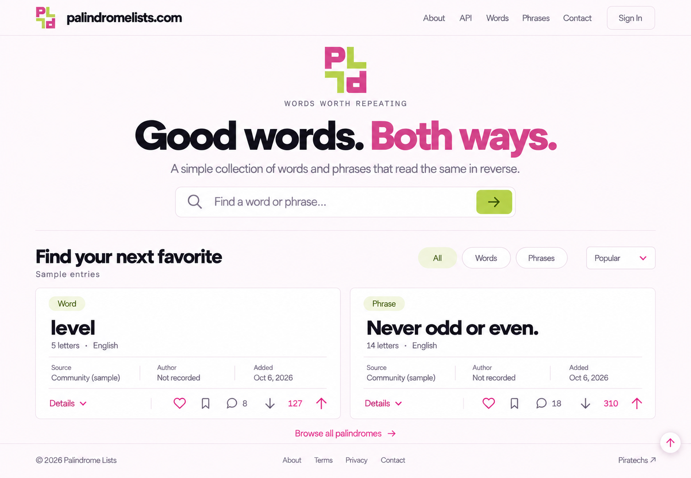

# palindromelists.com — Selected Pink & Lime Design v5

Pink and lime is the selected direction. This refinement adds the requested rotating hero monogram, visible card details, and reversed card actions on the right. All earlier rounds and original logo geometry are preserved.

| File | Purpose |
| --- | --- |
| [01-half-turn-pink-lime.svg](01-half-turn-pink-lime.svg) | Exact approved Half Turn paths, with both P shapes pink `#D64E8B` and both L shapes lime `#B6D94C`. |
| [02-pink-lime-landing.png](02-pink-lime-landing.png) | Visual snapshot of the selected page layout and updated cards. |
| [03-editable-landing-design.html](03-editable-landing-design.html) | Editable, responsive page with the actual infinite logo animation and working Details disclosures. |
| [04-generation-prompt.txt](04-generation-prompt.txt) | Exact prompt used with the built-in image generation tool to produce the PNG snapshot. |

## Hero

The complete PLPL monogram sits above **WORDS WORTH REPEATING**. In the HTML it rotates continuously through 360 degrees every eight seconds at a constant speed, using a CSS animation. The header and footer logo remain static. The existing reduced-motion preference stops the rotation. The PNG is a still image; the HTML contains the animation.

## Cards

Each card shows its type, palindrome, language, letter count, Source, Author, and Added date. Source records, entry dates, contributors, and engagement counts remain sample data; original authorship is **Not recorded**.

The footer has **Details** on the left and the action group on the right, in this left-to-right order: **Heart → Save → Comment → Downvote → Net score → Upvote**. DOM order follows the visual order for keyboard navigation. On narrow screens the footer can wrap without clipping controls.

Details opens a full-width panel with First recorded, Added by, and the sample-data explanation. The disclosure button uses `aria-expanded` and `aria-controls`.

Created folder: `assets/concepts/mockups/v5/`. The editable design preserves the existing header, internal menu destinations, search/filter previews, scroll behavior, footer, and palette. No tests, builds, UI checks, or publishing were run.
